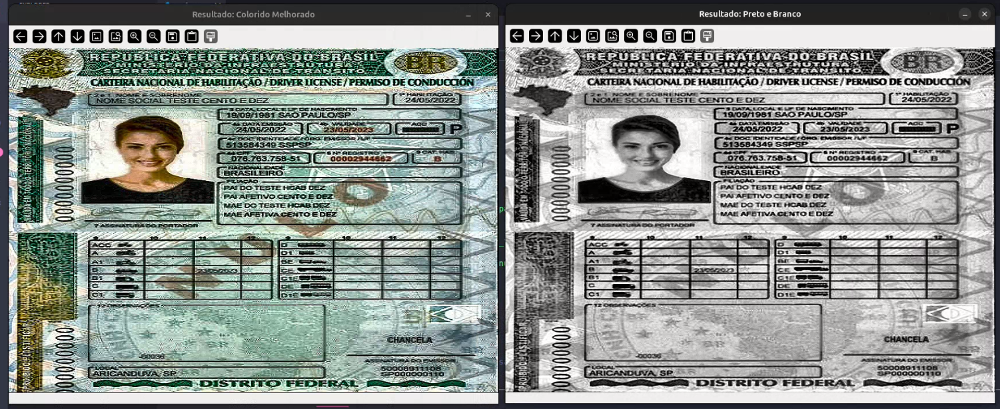

# Scanner de Documentos com OpenCV

Aplicação feita para a disciplina de Computação Gráfica. O objetivo é usar Visão Computacional clássica para resolver um problema comum: transformar uma foto ou imagem de webcam em um documento recortado, alinhado e mais legível.

O sistema funciona com webcam ou com uma imagem salva no computador. Depois da detecção, ele salva duas versões do documento:

- uma imagem colorida com contraste melhorado;
- uma imagem em tons de cinza com contraste e nitidez melhorados.

## Demonstração

Resultado gerado pelo modo imagem:



Vídeos da aplicação rodando:

- [Demonstração com webcam](assets/demo/webcam-demo.webm)
- [Demonstração com imagem do computador](assets/demo/image-mode-demo.webm)

## Problema Resolvido

Nem sempre temos um scanner disponível. Ao fotografar um documento com celular ou webcam, é comum a imagem sair torta, com perspectiva inclinada, fundo aparecendo e iluminação irregular.

Este projeto tenta automatizar esse processo:

1. encontra o documento na imagem;
2. identifica seus cantos;
3. corrige a perspectiva;
4. melhora a visualização;
5. salva os resultados na pasta `assets/output/`.

## Tecnologias

| Tecnologia | Uso no projeto |
| --- | --- |
| Python | Linguagem principal |
| OpenCV | Captura da webcam e processamento de imagem |
| NumPy | Cálculos com pontos, matrizes e transformações |

## Técnicas Utilizadas

O projeto usa técnicas de Visão Computacional clássica, sem modelos treinados. As principais etapas são:

### Captura e Leitura de Imagens

A webcam é aberta com `cv2.VideoCapture(0)`. No modo imagem, o arquivo é lido com `cv2.imread()`.

### Escala de Cinza

A imagem é convertida para tons de cinza para facilitar a análise de intensidade dos pixels:

```python
gray = cv2.cvtColor(image, cv2.COLOR_BGR2GRAY)
```

### Suavização

São usados filtros como `GaussianBlur` e `bilateralFilter` para reduzir ruídos antes da detecção de bordas.

```python
blurred = cv2.GaussianBlur(gray, (7, 7), 0)
```

### Threshold de Otsu

O threshold de Otsu separa automaticamente regiões claras e escuras. Ele é usado para ajudar a encontrar documentos claros sobre fundos mais escuros.

```python
_, mask = cv2.threshold(
    blurred, 0, 255, cv2.THRESH_BINARY + cv2.THRESH_OTSU
)
```

### Operações Morfológicas

O projeto usa `closing` e `opening` para fechar pequenas falhas e remover ruídos da máscara.

```python
mask = cv2.morphologyEx(mask, cv2.MORPH_CLOSE, kernel)
mask = cv2.morphologyEx(mask, cv2.MORPH_OPEN, kernel)
```

### Canny Edge Detection

O Canny detecta bordas importantes da imagem. Ele é usado quando a detecção por máscara não encontra um bom retângulo.

```python
edges = cv2.Canny(blurred, lower, upper)
```

### Contornos e Retângulos

Depois das bordas ou da máscara, o sistema procura contornos e tenta selecionar um quadrilátero parecido com o formato do documento.

```python
contours, _ = cv2.findContours(mask, cv2.RETR_EXTERNAL, cv2.CHAIN_APPROX_SIMPLE)
```

Também são usados `minAreaRect`, `boxPoints` e `approxPolyDP` para trabalhar com retângulos inclinados.

### Correção de Perspectiva

Com os quatro cantos encontrados, o documento é transformado para parecer visto de frente.

```python
M = cv2.getPerspectiveTransform(src_pts, dst_pts)
warped = cv2.warpPerspective(image, M, (width, height))
```

### Melhoria da Imagem

Na saída colorida, o projeto usa CLAHE no canal de luminosidade e um filtro de nitidez. Na saída em tons de cinza, ele aplica escala de cinza, redução leve de ruído, CLAHE e sharpening.

```python
clahe = cv2.createCLAHE(clipLimit=2.5, tileGridSize=(8, 8))
enhanced = clahe.apply(gray)
```

## Sobre Inteligência Artificial

Não há técnica de inteligência artificial envolvida no processamento. O projeto não usa rede neural, classificador treinado ou modelo pronto. A solução é baseada em algoritmos determinísticos do OpenCV.

## Estrutura

```text
DocScan/
├── assets/
│   ├── demo/           # imagem e vídeos usados no README
│   ├── input/          # imagens para testar o modo imagem
│   └── output/         # imagens geradas pelo programa
├── src/
│   ├── main.py         # menu, webcam e argumentos de execução
│   ├── scanner.py      # detecção do documento e correção de perspectiva
│   ├── utils.py        # funções de melhoria, salvamento e desenho
│   └── image_mode.py   # processamento de imagem salva no computador
├── requirements.txt
└── README.md
```

## Instalação

Clone o repositório:

```bash
git clone https://github.com/SEU-USUARIO/DocScan.git
cd DocScan
```

Crie e ative um ambiente virtual:

```bash
python3 -m venv .venv
source .venv/bin/activate
```

Instale as dependências:

```bash
pip install -r requirements.txt
```

## Como Usar

Menu interativo:

```bash
python src/main.py
```

Modo webcam:

```bash
python src/main.py --webcam
```

No modo webcam:

| Tecla | Ação |
| --- | --- |
| `S` | salva o documento detectado |
| `Q` | fecha o programa |

Modo imagem:

```bash
python src/main.py --image assets/input/CNH.jpg
```

## Saída Gerada

Os arquivos são salvos em `assets/output/`:

```text
scan_color_YYYYMMDD_HHMMSS.jpg
scan_gray_YYYYMMDD_HHMMSS.jpg
```

## Limitações

- A detecção depende de contraste entre documento e fundo.
- Reflexos fortes podem atrapalhar, principalmente em RG/CNH plastificado.
- Se algum canto estiver coberto, o recorte pode ficar impreciso.
- Ambientes muito escuros aumentam ruído e pioram a imagem final.

## Roteiro Para Apresentação

Sugestão para apresentar em 5 a 10 minutos:

1. mostrar o problema: documento fotografado fica torto e pouco legível;
2. executar `python src/main.py --webcam`;
3. mostrar o contorno detectando o documento;
4. salvar com a tecla `S`;
5. abrir a pasta `assets/output/` e mostrar os arquivos gerados;
6. executar o modo imagem com `python src/main.py --image assets/input/CNH.jpg`;
7. explicar rapidamente as técnicas: escala de cinza, blur, threshold, morfologia, Canny, contornos, perspectiva e CLAHE.

## Autoria

Projeto desenvolvido individualmente para a disciplina de Computação Gráfica.
